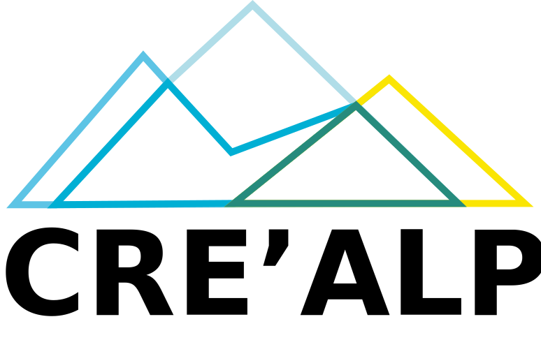

# CRE'ALPIN - Sensibiliser pour protéger l'espace alpin

## Client

CREA, le Centre de recherche sur les écosystèmes d'altitude, spécialisé dans l'étude des changements climatiques en milieu alpin.

## Brief

En 2020, l'équipe des scientifiques du CREA (centre de recherche sur les écosystèmes d'altitude) qui travaille sur les grands changements environnementaux, en partenariat avec l'ATLAS, le laboratoire collaboratif où les citoyens, les chercheurs et les décideurs se réunissent pour suivre les évolutions du milieu alpin et de son avenir, souhaitent valoriser la faune et la flore du pays du Mont-Blanc, en Haute-Savoie et sensibiliser aux impacts du changement climatique sur ces éléments.
Le site web Atlas Mont-Blanc : https://www.atlasmontblanc.org/

## Changements climatiques

En effet, les changements climatiques causent depuis le début de l'ère industrielle des changements radicaux dans ces paysages alpins (démarrage précoce du printemps, fonte des glaciers, etc.). Ces changements ont une forte incidence sur l'environnement physique et le monde du vivant. En savoir plus : (https://atlasmontblanc.org/explorer).

Les impacts sur la faune et la flore alpine les effets du changement climatique sur la faune et la flore alpine sont perceptibles et affectent déjà les dates des événements saisonniers, la distribution spatiale des espèces et leur abondance. La biodiversité, arrivera-t-elle à s’adapter au rythme très rapide d’évolution de l’environnement ? C’est tout le défi que les espèces animales et végétales devront résoudre dans un monde déjà très contraint par les activités humaines.

## Objectifs

L'objectif est de restituer aux visiteurs et aux randonneurs des informations sur l'évolution de ces massifs et leurs habitants au travers des années afin de les sensibiliser à leur sauvegarde et leur préservation de manière ludique et pratique.

Le groupement a ainsi réuni un ensemble de professionnels et d'amateurs sur 3 jours afin de faire naître des idées de communications inspirantes et responsabilisant.

Il en est sorti l'idée de proposer une application web adaptée aux tablettes et aux mobiles pour que les randonneurs puissent, au fil des sentiers balisés, obtenir des informations directement sur leurs appareils.

Des bornes, appelées "bornes de r'E-connexion" - pour se reconnecter avec son environnement - seront disposées le long des sentiers. Équipées de QRCodes, elles devront rediriger l'utilisateur sur la page de l'application correspondante et lui proposer du **contenu interactif sur l'environnement proche, la faune et la flore.**

L'application web sera accessible gratuitement et librement, elle fournira les informations suivantes :

- Position géographique des bornes de "r’E-connexion"
- Informations scientifiques contextuelles (provenant de la base de données de ATLAS) (textes, photos & photos interactives, illustrations, courtes vidéos, etc.), basées sur le lieu & les conditions météorologiques (température, précipitations, etc.)

Mais elle devra également permettre de soumettre des observations afin d'alimenter la base de ATLAS, via un formulaire. Ceci permettra aux randonneurs de proposer des observations textuelles et/ou visuelles à l'aide de clichés/vidéos (faune & flore), les données météorologiques, géographiques et temporelles seront automatiquement envoyées avec le formulaire. Pour ce faire, les utilisateurs devront être au préalable inscrits et connectés à leur compte.

## Cibles

Les randonneurs pédestres (~30 - 50 ans) en milieu alpin, au pays du Mont-Blanc, équipés de smartphones ou tablettes 4G/5G.

## Missions

Votre mission en tant qu'agence de communication & développement d'applications, est d'accompagner le CREA et ATLAS dans la réalisation de ce projet.

Vous devrez être force de proposition, afin d'avancer une solution à la fois opérationnelle, cohérente et valorisée par sa communication, dans l’objectif de la faire connaître au plus grand nombre.

Cette application web aura également pour but de faire découvrir la CREA et ATLAS au grand public pour les inviter à participer à cette aventure de préservation citoyenne des milieux alpins.
